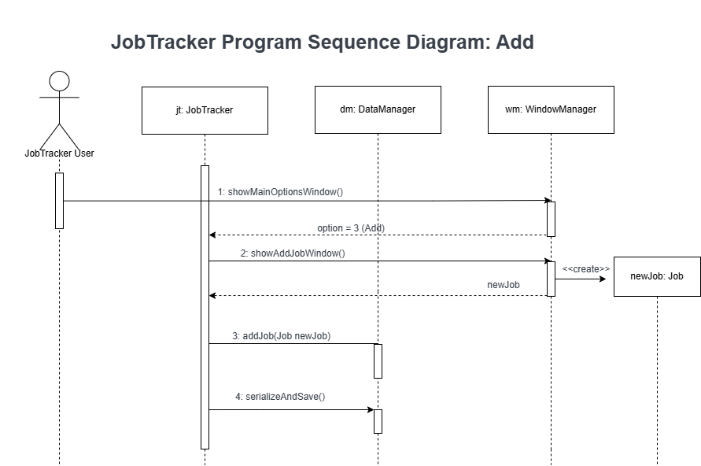

# Job Application Tracker
## Description
In today's fluctuating job market, effectively organizing and tracking your job applications can save you hours and reduce stress. 
This application is designed to help users manage their job applications simply and efficiently.

## Instructions to run program

### Prerequisites
- Make sure you have Java installed on your computer. You can check this by running `java -version` in your command prompt or terminal. If Java is not installed, download and install it from [Oracle's official website](https://www.oracle.com/java/technologies/javase-downloads.html).
### Compile the Java Files
1. Open your command prompt or terminal.
2. Navigate to the directory containing your Java files. For example:

```bash
cd path/to/your/java/files
```
3. Compile all the Java files using the following command:
```bash
javac *.java
```

### Run the Program
1. In the same directory, execute the following command to start the program:
```bash
java JobTracker
```
2. Follow any on-screen instructions to interact with the program.

### Additional Tips
- Ensure that all Java files (`*.java`) are in the same directory or properly reference each other if located in different packages or directories.
- If your Java files are part of a package, the `cd` command should navigate to the root directory above the package structure, and you should include the package name when running the `java` command, like `java package_name.JobTracker`.
- If there are any additional libraries or dependencies, ensure they are correctly referenced in your compile and run commands, typically with the `-cp` or `-classpath` option.


# UML diagrams for program
## Usecase Diagram

## Sequence Diagrams





## Class Diagram


## Team Members
- [Eugene Chang (ec4338)](https://github.com/egnechng)
- [Safi Patel (sp6559)](https://github.com/safipatel)
